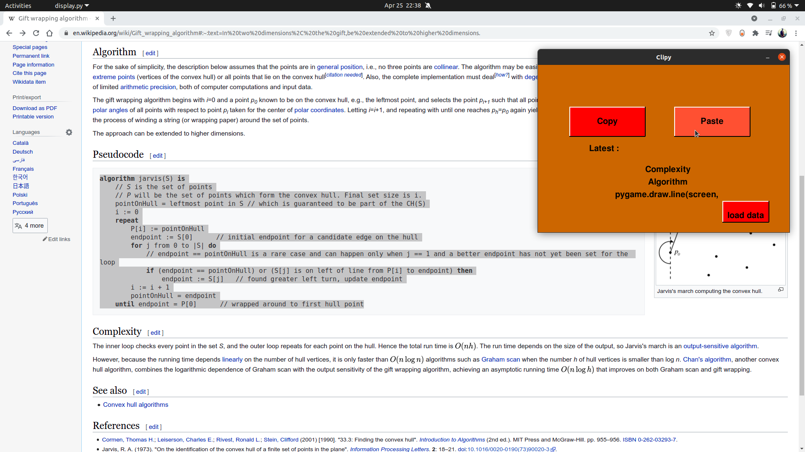
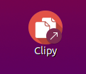
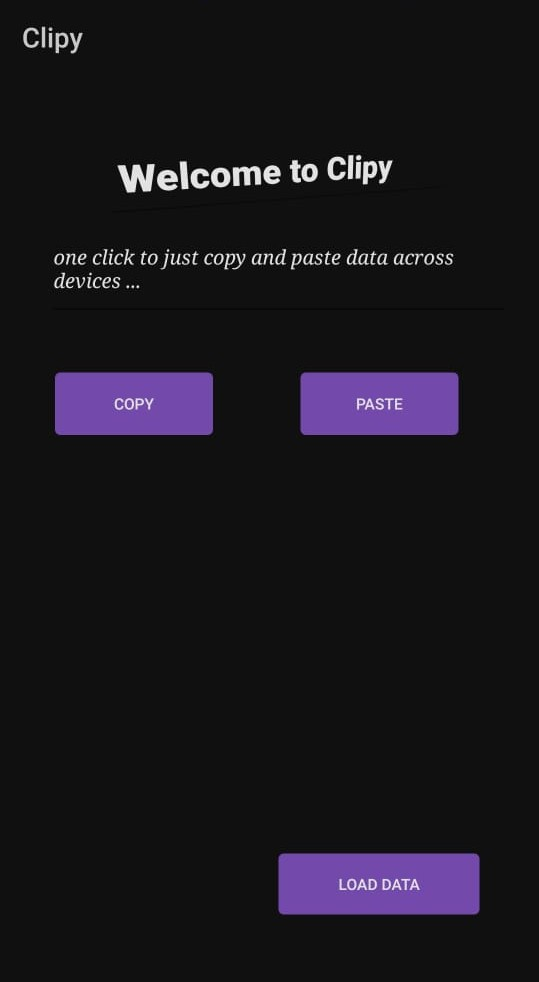

# Clipy

### Have you ever wonderd how it would be to just copy on one device and then paste it directly onto another...!

*Well only a very few operating systems have this feature and only a few applications are there to support the connection between your phone and pc*

***Now I have created an application through which you can just paste some text and using the same application on another device you can just paste it***

***Well isn't it helpful  !!!***

***I started setting up Firebase realtime database for this project and using ["Admin Database API"](https://firebase.google.com/docs/database/admin/start) for the API calls for saving and retrieving data using python and sending and recieving data in json***

***The data that is copied in one device stays intact onto the clipboard, to get that information - use pyperclip***
```bash
pip install pyperclip
```
***It has basic function to copy and paste the latest content that is on the clipboard, similar way I used it to copy the content from clipboard and paste it onto database and then on other device just copy the content from database.***
```bash
def paste_data(): # paste data into the database.

# As an admin, the app has access to read and write all data, regradless of Security Rules

    textp = pc.paste()
    # ref.set(textp)
    data  = {
        'text' : textp
    }
    json_object = json.dumps(data, indent = 1)
    ref.push(json_object)
```
***Note: For inserting lists of data i hade to add a rule on thhat perticular child I was sending data to as ".indexOn" : "text"... here text was refering to the .valueOn

***For Desktop interface I used python to develop the display***
<p align="centre"></p>

***And later on I converted it into executable file as:***

***Keep this on the first line of the file you want to convert as executable***
```python
#!/usr/bin/env python3
```

***Then just open the terminal and go the folder where the file is stored and then type:***
```bash
chmod +x display.py
```

***That's it, your file is now execuatble. If you want to check it then in termianl just type:***
```bash
./your-file-name.py
```

***To make it into a Desktop Application just create a file on your desktop with the name "my-file.desktop" and in it:***
```bash
[Desktop Entry]
Version=1.0
Name=name-you-want-to-display
Exec=folder-path/my-file.py
Icon=folder-path/my-file-icon.png
Type=Application
```
***For Linux***

***Now just right click on the file you saved on desktop and click on "Allow Launching"... and now it's ready to be launched***
<p align="left"></p>

**The next phase is craeting an app that could do the same process of sending and retrieving the data from firebase realtime-database**

*I created a basic app layout using android studio*
<p align="center">

</p>

***For backend... Connect the app to firebase databse by accessing you firebase project and adding it in the firebase interface and also installing the dependencies***

***Transfer and retrieval of data is better in json***
